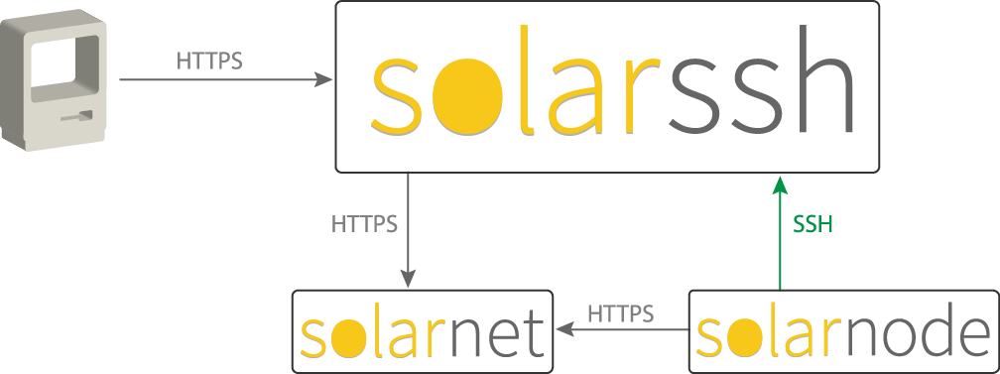

# SolarSSH

This project is a cloud-based server that enables accessing SolarNode devices
via a SSH tunnel. It works with the SolarNode System SSH plugin to
establish a SSH connection between SolarNode and this SolarSSH server and
then allows both command line and web browser-based terminal access through the SSH connection.

In addition to providing a way to access a terminal shell on SolarNode, SolarSSH
provides a reverse HTTP proxy for the SolarNode web server. This means the
SolarNode setup GUI can be accessed as well.

See the [SolarSSH Guide][guide] for more information. See the [SolarSSH Webterminal][webterm]
project for a browser-based terminal UI.

# Quick networking overview

Here's a diagram that shows how the various components involved with SolarSSH
initiate network connections, and the protocols used:

As you can see, no component initiates a network connection _to_ SolarNode.
Instead, all traffic is tunneled to SolarNode over the SSH connection it
_initiates_ to SolarSSH.

# SolarSSH deployment

SolarSSH has been designed to be easily deployable on your own infrastructure.
It uses the public SolarNetwork API to communicate with SolarNetwork, and thus
can be deployed just about anywhere. See the [deployment guide][solarssh-deploy]
for more information.

# SolarSSH API

If you want to build an app that uses SolarSSH (like the [SolarSSH Web
Terminal][webterm] webapp) the [SolarSSH API][solarssh-api] is
documented on the SolarNetwork wiki.

[guide]: https://github.com/SolarNetwork/solarnetwork/wiki/SolarSSH-Guide
[webterm]: https://github.com/SolarNetwork/solarssh-webterminal/
[solarssh-api]: https://github.com/SolarNetwork/solarnetwork/wiki/SolarSSH-API
[solarssh-deploy]: https://github.com/SolarNetwork/solarnetwork/wiki/SolarSSH-Deployment-Guide
